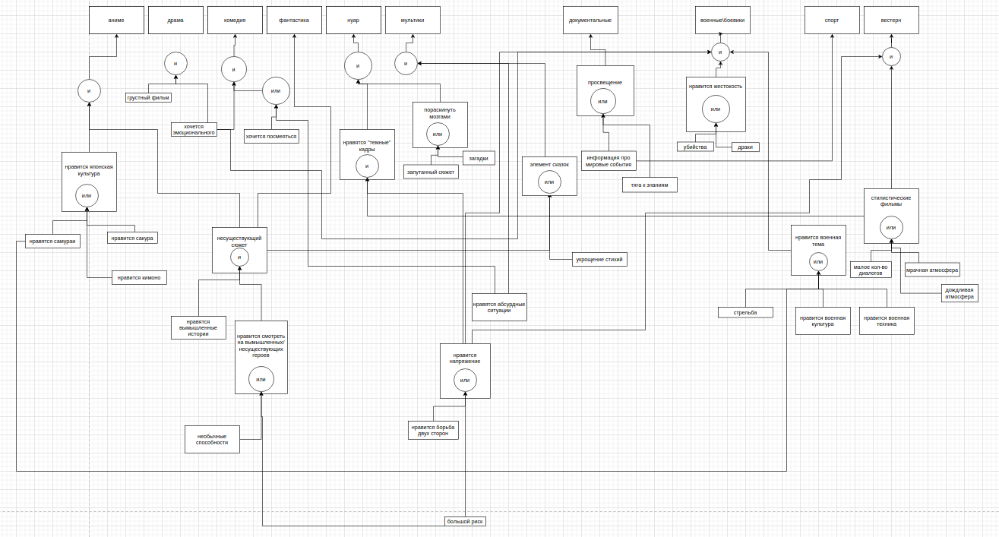

# Отчет по лабораторной работе
## по курсу "Искусственый интеллект"

### Студенты: 

| ФИО               | Роль в проекте                           | Оценка         |
| -----------       | ------------------------------------     | -------------- |
| Шичко Алексей     | Формализация предметной области, капитан |                |
| Бердикин Тимофей  | Объединение. Написание отчёта            |                |
| Катермин Всеволод | Реализовал оболочку ЭС на `python`       |                |
| Ахунов Константин | Создание портрета человека               |                |

## Результат проверки

| Преподаватель       | Дата           | Оценка          |
| ------------------- | -------------- | --------------- |
| Сошников Д.В.       |                |                 |

> *Комментарии проверяющих (обратите внимание, что более подробные комментарии возможны непосредственно в репозитории по тексту программы)*

## Тема работы

Разработка системы, рекомендующей фильмы, исходя из различных имеющихся знаний о человеке.

## Концептуализация предметной области

<!-- Опишите результаты концептуализации предметной области: -->
<!--  - выделенные понятия -->
<!--  - связи между ними, тип получившейся онтологии (словарь, сеть, иерархия и т.д.) -->
<!--  - опишите возможные статические и динамические знания -->
<!--  - как предметная область может быть разделена между участниками для коллективного создания базы знаний  -->

<!-- TODO: про статические и динамические у Всеволода должно быть, т.к. он эксп систему писал -->

Было выбрано процедурное представление знаний, так как его графическое представление (дерево «И/ИЛИ») представляет собой граф.

Предметная область была разделена таким образом, чтобы два эксперта по знаниям могли работать независимо друг от друга. Первый эксперт выделял жанры фильмов, и возможную иерархию групп лиц, которым эти жанры понравятся. Второй эксперт выделял характеристики этих самых групп лиц. Таким образом, оставалась одна маленькая деталь, связать характеристики групп лиц с самими группами.

Вот например как выглядит верхняя часть дерева:



## Принцип реализации системы

Мы решили воспользоваться прямым выводом. Для этого достаточно было воспользоваться  CLIPS  с помощью библиотеки на python Pyknow. Prolog мы помнили хуже, чем python, поэтому выбор лег именно на этот язык программирования. В начале  система задает пользователю вопросы, а затем обрабатывает ответы и выдает результат.

## Механизм вывода

Мы узнаем интересы нашего пользователя и заносим их в список фактов о нем. В Pyknow заданы правила с помощью которых факты из списка проверяются и доказываются, а впоследствии добавляются в память. Это повторяется до тех пор пока мы не  найдем интересующие нас утверждения.  
Правила в системе Pyknow  
```
class Film(KnowledgeEngine):
   result=[]

   @Rule(OR(Fact(age='подросток(13-18)'),
       Fact('необычные способности')))
   def unreal_heroes(self):
       self.declare(Fact('нравится смотреть на вымышленных\несуществующих героев'))

   @Rule(Fact(age='подросток(13-18)'))
   def unreal_history(self):
       self.declare(Fact('нравятся вымышленные истории'))

   @Rule(Fact(age='старше 40'))
   def world_news(self):
       self.declare(Fact('информация про мировые события'))

   @Rule(OR(Fact(grad='высшее образование'),Fact(grad='неоконченное высшее образование'),Fact(age='подросток(13-18)'),Fact(age='половозрелый(19-40)')))
   def found_of_history(self):
       self.declare(Fact('увлекаемся историей'))
  
   @Rule(OR(Fact('нравится сакура'),Fact('нравятся самураи'),Fact('нравится кимоно')))
   def japan_cul(self):
       self.declare(Fact('нравится японская культурая'))
  
   @Rule(AND(Fact('нравится смотреть на вымышленных\несуществующих героев'),Fact('нравятся вымышленные истории')))
   def unreal_screen(self):
       self.declare(Fact('несуществующий сюжет'))

   @Rule(OR(AND(Fact(sex='женщина'),Fact(age='половозрелый(19-40)')),Fact(temp='флегматик'),Fact(temp='сагвинник'),Fact(temp='меланхолик')))
   def emotional(self):
       self.declare(Fact('хочется эмоционального'))

   @Rule(OR(AND(Fact(sex='мужчина'),Fact(age='половозрелый(19-40)')),Fact(temp='холерик'),Fact('драки'),Fact('убийства')))
   def cruel(self):
       self.declare(Fact('нравится жестокость'))

   @Rule(OR(Fact(age='половозрелый(19-40)'),Fact('нравится борьба двух сторон')))
   def tension(self):
       self.declare(Fact('нравится напряжение'))

   @Rule(OR(Fact('нравятся самураи'),Fact('нравится оружие'),AND(Fact(sex='мужчина'),Fact(age='половозрелый(19-40)'),
   Fact('нравится военная техника'),Fact('нравится военная культура'))))
   def military(self):
       self.declare(Fact('нравится военная тема'))

   @Rule(AND(Fact('нравится напряжение'),Fact('стилистические фильмы')))
   def dark_cadr(self):
       self.declare(Fact('нравятся "тёмные" кадры'))

   @Rule(OR(Fact('мрачная атмосфера'),Fact('малое количество диалогов')))
   def style_film(self):
       self.declare(Fact('стилистические фильмы'))

   @Rule(OR(Fact('нравятся животные'),Fact('увлекаемся историей'),Fact('информация про мировые события')))
   def education(self):
       self.declare(Fact(film='документальные'))

   @Rule(AND(Fact('несуществующий сюжет'),Fact('нравится японская культурая')))
   def anime(self):
       self.declare(Fact(film='аниме'))

   @Rule(AND(Fact('несуществующий сюжет'),Fact('увлекаемся историей')))
   def fantastic(self):
       self.declare(Fact(film='фантастика'))
  
   @Rule(AND(Fact('ребёнок (<12)'),Fact('элемент сказок'),Fact('нравятся абсурдные ситуации'),Fact('семья')))
   def cartoon(self):
       self.declare(Fact(film='мультфильмы'))
  
   @Rule(AND(Fact('грустный фильм'),Fact('хочется эмоционального')))
   def drama(self):
       self.declare(Fact(film='драмма'))

   @Rule(AND(Fact('семья'),Fact('хочется эмоционального'),OR(Fact('хочется посмеяться'),Fact('нравятся абсурдные ситуации'))))
   def comedy(self):
       self.declare(Fact(film='комедия'))
  

   @Rule(AND(Fact('нравится напряжение'),Fact('хочется эмоционального'),Fact('нравится жестокость'),Fact('нравится военная тема')))
   def boevik(self):
       self.declare(Fact(film='военные\боевики'))

   @Rule(AND(Fact('нравятся страшные истории'),Fact('хочется эмоционального')))
   def screamer(self):
       self.declare(Fact(film='ужасы'))

   @Rule(AND(Fact('Пораскинуть мозгами'),Fact('нравятся "тёмные" кадры')))
   def nuar(self):
       self.declare(Fact(film='нуар'))
  
   @Rule(AND(Fact('нравится напряжение'),Fact('стилистические фильмы')))
   def vestern(self):
       self.declare(Fact(film='вестерн'))

   @Rule(AND(Fact('нравится заниматься спортом'),Fact('информация про мировые события')))
   def sport(self):
       self.declare(Fact(film='спорт'))

      
   @Rule(Fact(film=MATCH.a))
   def print_result(self,a):
       self.result.append(a)
       print(f'Жанр- {a}')
                  
   def factz(self,l):
       for x in l:
           self.declare(x)
```           
## Извлечение знаний и база знаний

<!-- Опишите, как происходило извлечение знаний, с учётом совместной работы над проектом. Приведите фрагменты представления знаний: дерево И-ИЛИ, наиболее интересные правила.  -->
Извлечение знание происходило «сверху-вниз». Сначала определялись наиболее разносторонние жанры фильмов, а затем выдвигались различные теории, каким группам лиц может понравится этот фильм. Таким образом, получалось дерево «И/ИЛИ» в котором определенные жанры нравятся только лица, входящие в какие-то группы.

Затем, эксперт по созданию портрета человек определял, какими вопросами можно определить, будет ли человек принадлежать выбранной группе. Может даже одним вопросом, можно узнать ответы сразу для нескольких групп (в этом нам поможет вывод экспертной системы).

## Протокол работы системы
Пример 1:
---
<!-- TODO: у всеволода -->


Пример 2:
---


## Выводы

<!-- Сформулируйте *содержательные* выводы по лабораторной работе. Чему он вас научила?  -->
<!-- Над чем заставила задуматься? В чём состояли основные сложности в работе? Насколько эффективной получилась командная работа, и какие методы для повышения эффективности командной работы вы использовали (scrum, slack, ...)? -->
<!--  -->
<!-- Помните, что несодержательные выводы - -->
<!-- самая частая причина снижения оценки. -->

<!-- TODO: надеюсь тут кто-нибудь кроме меня напишет абзац -->

Экспертные системы позволяют нам узнать, почему был вынесен определенный вердикт. Мы всегда можем отследить ход «мыслей» системы по дереву вывода.

Экспертная система является неким усовершенствованием привычной всем конструкции if-else. Ведь алгоритм вывода экспертной системы, позволяет спрашивать только те факты, которые необходимы для доказательства очередного суждения. Рабочая память (или же статические знания) позволяют не спрашивать у пользователя один и тот же вопрос несколько раз. Динамическая память (база знаний) и инженер по знаниям, позволяют формализовать знания эксперта.

Основная сложность работы заключалось в построении отсекающих вопросов, фактов и установлении связей между ними. Было замечено, что вспомнить пролог оказалось не так сложно, так как он основан на логике, а экспертная система подразумевает логический подход.

Благодаря данной лабораторной работе мы научились работать в команде, что было довольно трудно, так как состав команды определялся случайно. Основное общение у нас было в discord. Нам очень понравилась наша концепция экспертной системы , нам кажется она могла быть полезной для людей, которым трудно сделать выбор, а также компаниям людей во время совместного выбора фильма. Мы думаем в будущем нам понадобятся навыки создания экспертных систем, ведь не всегда нужно заниматься сложным машинным обучение, когда можно воспользоваться достаточно несложной логикой экспертных систем.
